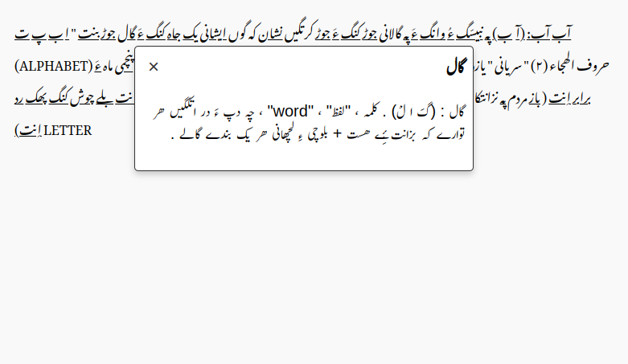

# SayadganjQuickDef

**SayadganjQuickDef** is based on the Balochi dictionary *Sayadganj* and makes it easy to add word definitions to your website. It automatically highlights Balochi words and displays a popup with their meanings when clicked, allowing users to quickly access definitions without leaving the page.

---

## Features

- Automatically underlines Balochi words in the text.
- Displays a definition popup when a word is clicked.
- Responsive: desktop tooltips and mobile bottom-sheet dialogs.
- Easy integration with one script inclusion.
- Handles words with and without punctuation or symbols.

---

## Integration

### 1. Add the Script via CDN

To include the **SayadganjQuickDef** script in your website, simply add the following `<script>` tag to your HTML file (inside the `<head>` or before the closing `<body>` tag):

#### Minified Version (Recommended)
```html
<script src="https://cdn.jsdelivr.net/gh/umairayub79/SayadganjQuickDef/sayadganj-quick-def.min.js"></script>
```

#### Full Version
```html
<script src="https://cdn.jsdelivr.net/gh/umairayub79/SayadganjQuickDef/sayadganj-quick-def.js"></script>
```

#### Using a Specific Version (Major/Minor)
If you want to use a specific version to prevent automatic updates, modify the CDN URL:

Use the latest patch of a major version:

```html
<script src="https://cdn.jsdelivr.net/gh/umairayub79/SayadganjQuickDef@1/sayadganj-quick-def.min.js"></script>
```
Use a specific minor version:

```html
<script src="https://cdn.jsdelivr.net/gh/umairayub79/SayadganjQuickDef@1.2/sayadganj-quick-def.min.js"></script>
```
This script will automatically underline Balochi words on your webpage and show popups with their definitions when clicked.

### 2. Add CSS for the Popup (Optional)

The script comes with default styling, but you can further customize the popup appearance by adding or overriding styles:

```html
<style>
  .balochi-popup {
  background-color: white;
  border: 1px solid #333;
  padding: 10px;
  z-index: 1000;
  box-shadow: 0 4px 8px rgba(0, 0, 0, 0.2);
  border-radius: 5px;
  width:400px;
  max-height: 80vh; /* Ensure popup doesn't take up more than 80% of the viewport height */
  overflow-y: auto; /* Add scroll if content overflows */
  font-family: Arial, sans-serif;
}
.popup-content h3 {
  margin-top: 5px;
  margin-right: 5px;
  font-size: 24px;
}

.popup-content ul li {
  margin-bottom: 8px;
  border-bottom: 1px solid #eee;
  padding-bottom: 4px;
  font-size: 20px;
}

.balochi-word {
  text-decoration: underline;
  cursor: pointer;
}

/* Styles for the close button */
.popup-close {
  position: absolute;
  top: 10px;
  left: 10px;
  background: none;
  border: none;
  font-size: 24px;
  cursor: pointer;
  color: #333;
}

.popup-close:hover {
  color: #ff0000;
}

/* Styles for mobile bottom sheet dialog */
.mobile-bottom-sheet {
  position: fixed;
  bottom: 0;
  left: 0;
  right: 0;
  width: 100%;
  max-height: 60%;
  min-height:40%;
  border-radius: 15px 15px 0 0;
  padding: 20px;
  box-shadow: 0 -4px 12px rgba(0, 0, 0, 0.2);
  background-color: white;
  transition: transform 0.3s ease-out;
  transform: translateY(100%);
  opacity: 0;
  transition: transform 0.3s ease-out, opacity 0.3s ease-out;
}

.mobile-bottom-sheet.show {
  transform: translateY(0);
  opacity: 1;
}
</style>
```
---

## How It Works

1. **Word Highlighting:** The script scans all `<p>` and `<span>` elements for Balochi words and underlines them.
   
2. **Popup Display:** 
   - On desktop, a popup appears near the clicked word.
   - On mobile devices, a bottom-sheet slides up from the bottom.

3. **Punctuation Handling:** The script removes punctuation or symbols from words, ensuring accurate dictionary lookups even with commas, periods, etc.

---

## Screenshot




